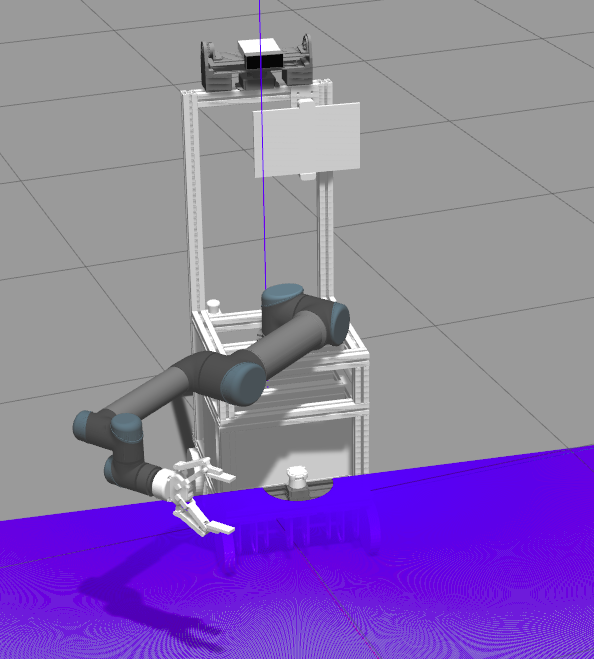

# Tinker robot simulation model



### Clone Repositories

```
git clone --recursive git@github.com:tinkerfuroc/simulation_model.git
```

### Install modules

```
sudo apt install ros-melodic-nav-core ros-melodic-soem ros-melodic-geometric-shapes ros-melodic-moveit-msgs ros-melodic-socketcan-interface ros-melodic-moveit-core ros-melodic-industrial-msgs ros-melodic-moveit-kinematics ros-melodic-gazebo-ros-control ros-melodic-joint-state-controller ros-melodic-effort-controllers ros-melodic-velocity-controllers ros-melodic-apriltag-ros ros-melodic-industrial-robot-status-interface ros-melodic-ur-client-library ros-melodic-controller-manager ros-melodic-controller-interface ros-melodic-joint-trajectory-controller ros-melodic-gripper-action-controller ros-melodic-moveit ros-melodic-rosserial

pip3 install pymodbus
```

### Compile the project

```
cd simulation_model
catkin_make
```

### Start Simulation

```
source devel/setup.bash
roslaunch simulation start.launch
```
